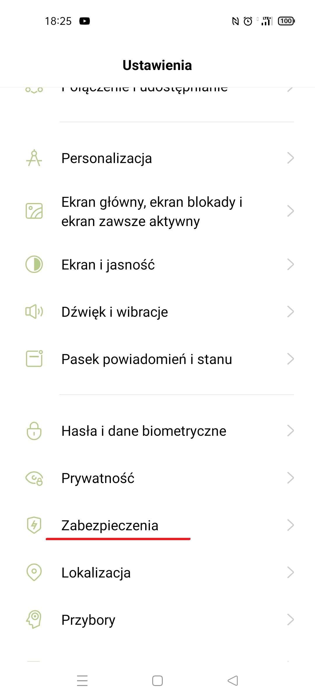
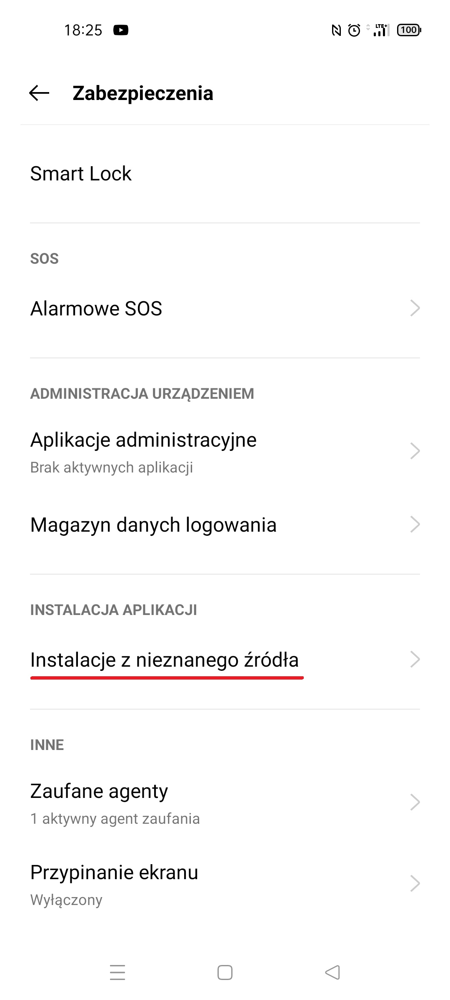

Tworzona w ramach pracy inżynierskiej gra edukacyjna do nauki matematyki.

* * *

Najnowszą wersję gry można pobrać <a href='https://github.com/pala19/edu-unity-game/releases/download/v.1.0-beta/edu-unity-game-v-2-0.apk'> tutaj </a>.

Instalacja gry na urządzeniu z Androidem:

1) Kopiujemy plik .apk na urządzenie w dowolny sposób, np. poprzez podłączenie urządzenia do komputera kablem USB, wysłanie mailem, poprzez bluetooth, itp.

2) Możliwe, że przed instalacją gry trzeba będzie włączyć w opcjach Androida możliwość instalacji aplikacji spoza Sklepu Play. W zależności od wersji Androida, opcje te mogą się znajdować w innym miejscu i mogą się trochę inaczej nazywać.
3) Wchodzimy do folderu, do którego skopiowaliśmy plik .apk za pomocą Menedżera plików. Kliknięcie w ikonę pliku powinno uruchomić instalację. Może wymagać potwierdzenia instalacji przez użytkownika.
4) Ikona aplikacji o nazwie edu-unity-game powinna się pojawić na ekranie głównym urządzenia.

<b>UWAGA.</b> Gra została stworzona na system Android, nie zadziała na systemie iOS w iPhonach.

* * *

Przykład włączenia opcji instalacji aplikacji spoza Sklepu Play.

Model telefonu: OPPO Reno5 Z, wersja Androida: 11

Wchodzimy w Ustawienia telefonu:

Wystarczy, aby opcja instalacji z nieznanego źródła była włączona dla Menedżera plików.

* * *

Opinie i uwagi mile widziane :) Prosiłabym o wysłanie ich na maila p.biruta19@gmail.com

