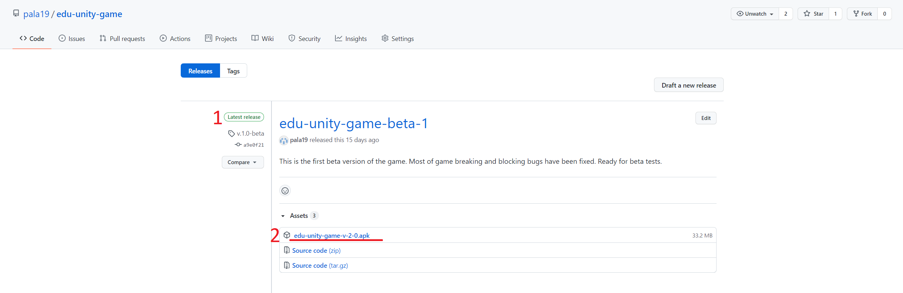

Tworzona w ramach pracy inżynierskiej gra edukacyjna ucząca matematyki.

Najnowszą wersję gry można pobrać <a href='https://github.com/pala19/edu-unity-game/releases/latest/'> tutaj </a>.

Instrukcja pobrania gry:

1) Upewniamy się, że wersja gry jest najnowsza - musi być przy niej dopisek <b>latest release </b>.

2) Pobieramy plik z rozszerzeniem <b>.apk</b> klikając na jego nazwę. 

Instalacja gry na urządzeniu z Androidem:

1) Kopiujemy plik .apk na urządzenie w dowolny sposób, np. poprzez podłączenie urządzenia do komputera kablem USB, wysłanie mailem, poprzez bluetooth, itp.

2) Możliwe, że przed instalacją gry trzeba będzie włączyć w opcjach Androida możliwość instalacji aplikacji z nieznanego źródła. Niestety, w zależności od wersji Androida, opcje te mogą się znajdować w innym miejscu.

Przykład: 
Model telefonu: OPPO Reno5 Z
Android: 11

Wchodzimy w Ustawienia telefonu:

 

Wystarczy, aby opcja instalacji z nieznanego źródła była włączona dla menedżera plików.

3) Wchodzimy do folderu, do którego skopiowaliśmy plik .apk za pomocą Menedżera plików. Kliknięcie w ikonę pliku powinno uruchomić instalację.

4) Ikona aplikacji o nazwie edu-unity-game powinna się pojawić na ekranie głównym urządzenia.

<b>UWAGA.</b> Gra została stworzona na system Android, nie zadziała na systemie iOS w iPhonach.

Opinie i uwagi mile widziane :) Prosiłabym o wysłanie ich na maila p.biruta19@gmail.com

