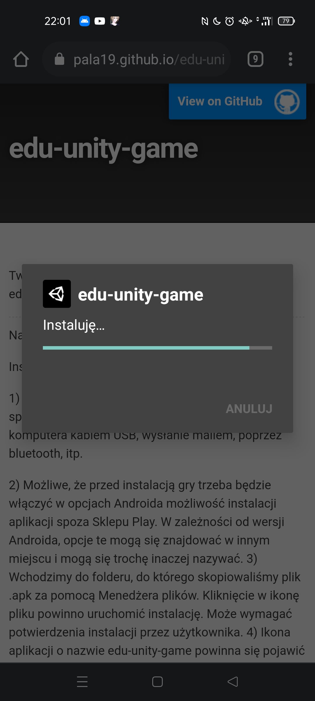

Tworzona w ramach pracy inżynierskiej gra edukacyjna do nauki matematyki.

* * *

Najnowszą wersję gry można pobrać <a href='https://github.com/pala19/edu-unity-game/releases/download/v.1.0-beta/edu-unity-game-v-2-0.apk'> tutaj </a>.

Instalacja gry na przykładzie Androida 11:

Otwieramy stronę na telefonie i klikamy w powyższy link:

Klikamy w Pobierz.

Klikamy w Ok. 

Ten komunikat nie oznacza, że gra jest niebezpieczna! Komunikat pojawia się, ponieważ aplikacja nie jest dostępna w sklepie Play. 

Klikamy w Otwórz.

Może się pojawić taki komunikat. Kikamy w Ustawienia.

Odznaczamy Zezwól na instalację z tego źródła. Nastepnie klikamy na strzałkę Wstecz.

Klikamy zainstaluj.

Klikając na Otwórz, uruchamiamy grę.

Ikona aplikacji na pulpicie telefonu.

<b>UWAGA.</b> Gra została stworzona na system Android, nie zadziała na systemie iOS w iPhonach.

Opinie i uwagi mile widziane :) Prosiłabym o wysłanie ich na maila p.biruta19@gmail.com

