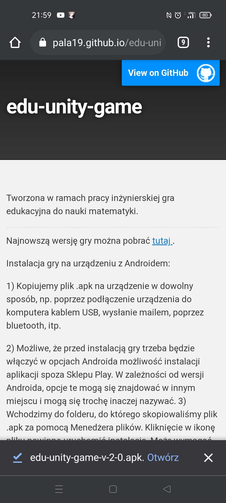

Tworzona w ramach pracy inżynierskiej gra edukacyjna do nauki matematyki.

* * *

Najnowszą wersję gry można pobrać <a href='https://github.com/pala19/edu-unity-game/releases/download/v.1.0-beta/edu-unity-game-v-2-0.apk'> tutaj </a>.

Instalacja gry:

<b>UWAGA.</b> Gra została stworzona na system Android, nie zadziała na systemie iOS w iPhonach.

Opinie i uwagi mile widziane :) Prosiłabym o wysłanie ich na maila p.biruta19@gmail.com

